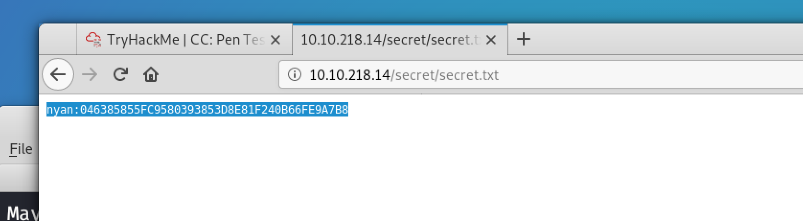

# 
[https://tryhackme.com/room/ccpentesting](https://tryhackme.com/room/ccpentesting)

## Open Ports:
  - 21: ssh
  - 80: HTTP
  
## Port 80:
1. find sub-doamisn and directories usind **dirb**
   - ip/secret
2. Run **dirbuster** with txt as file extension
   - ip/secret/secret.txt

   
## Gaining Access:
 1. use the username and password found in **secret.txt**
    >ssh nyan:xxxxxxxxxxxxxxxxxxxxxxx@ip
 2. The password is sha1 and can be cracked in [crackstation.com](crackstation.com)

### USER Flag:

 

## Privilege Escalation:
 - sudo -l
    - found no password for /bin/su
      >sudo su
  
### Root Flag:

